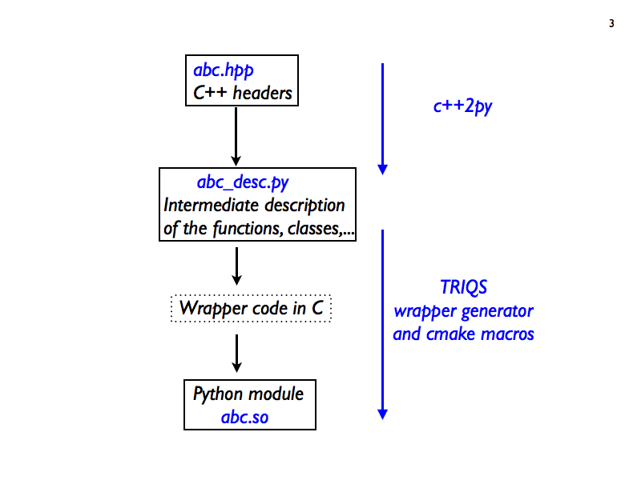

.. index:: wrapper

General Principle
=================

c++2py works in two steps, illustrated in Fig. `c++2py.png`_.

#. The analysis of the C++ code (header) *abc.hpp* of the functions and classes to be exposed to Python
   produces a file *abc_desc.py*.
   This file is a description of the objects to be exposed from C++ to Python.
   This description is itself written in Python, with an API presented in _documentation/manual/cpp2py.

#. From the description file *abc_desc.py*, the tool generate the C wrapping code, which is then compiled with the C++
   code to produce the Python module *abc.so* ready to be imported in Python.

Remarks:

* Some advanced features are obtained by modifying (or writing from scratch) the abc_desc.py file.

* The first step requires the use of the Clang compiler (libclang to be precise), while
  the second step does not. Typically the *abc_desc.py* is generated by the developer and
  distributed along with the source to compile in non-clang environment.

