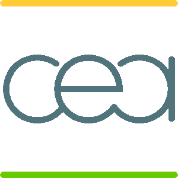
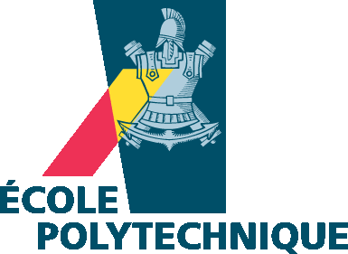
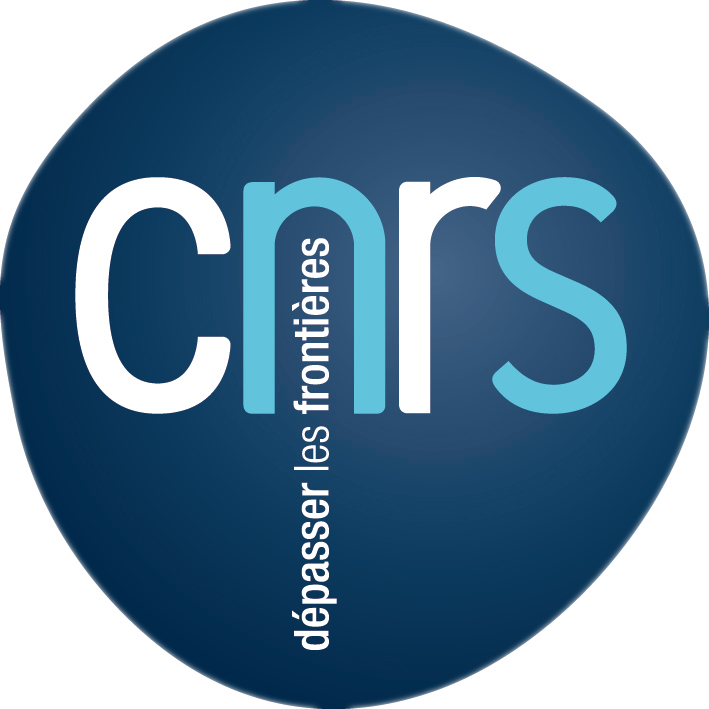

.. meta::
   :description: TRIQS: a Toolbox for Research on Interacting Quantum Systems
   :keywords: triqs quantum interacting systems toolbox research

.. _welcome:

Welcome
=======

.. sidebar:: TRIQS 3.1

   This is the homepage TRIQS Version 3.1
   For the changes in 3.1, Cf :ref:`changelog page <changelog>`

      .. image:: _static/logo_github.png
         :width: 75%
         :align: center
         :target: https://github.com/triqs/triqs

TRIQS (**T**\oolbox for **R**\esearch on **I**\nteracting **Q**\uantum **S**\ystems)
is a scientific project providing a set of C++ and Python libraries to develop new tools
for the study of interacting quantum systems.

The goal of this toolkit is to provide high level, efficient and simple to use
libraries in C++ and Python, and to promote the use of modern programming
techniques.

TRIQS is free software distributed under the GPL license.

TRIQS applications
-----------------------

Based on the TRIQS toolkit, several :ref:`full-fledged applications<applications>`
are also available. They allow for example to solve a generic quantum impurity
model or to run a complete DFT+DMFT calculation.

Developed in a collaboration between IPhT Saclay and Ecole Polytechnique since 2005,
the TRIQS library and applications have allowed us to address questions as diverse as:

* Momentum-selective aspects on cuprate superconductors (with various cluster DMFT methods)
* Degree of correlation in iron-based superconductors (within an DFT+DMFT approach)
* Fermionic Mott transition and exploration of Sarma phase in cold-atoms

Python & C++
-----------------------------

The libraries exist at two complementary levels: on the one hand, C++ libraries
allow to quickly develop high-performance low-level codes; on the other hand
python libraries implement the most common many-body objects, like Green's
functions, that can be manipulated easily in python scripts.

This duality is a real advantage in the development of new many-body tools.
Critical parts where performance is essential can be written in C++ (e.g. a
quantum impurity solver) while the data analysis, preparation of the inputs or
interface with other programs can be done at the very user-friendly python
level.

Where to start?
---------------

First, visit our :ref:`Install <triqs_install>` section to obtain the TRIQS library.

We then strongly recommend first-time users to go through the extensive set of Jupyter Notebook tutorials provided on `GitHub <https://github.com/TRIQS/tutorials>`_.
You can run the notebooks either in an interactive `Binder Session <https://triqs.github.io/notebook>`_ on the web
or run them locally after setting up TRIQS on your computer.

To get an overview of the main TRIQS classes and their organizations, you can browse through the ready-to-use code snippets of our
:ref:`User guide <triqs_userguide>` section.

After those steps, you will be familiar with the library and can use the complete :ref:`Documentation <documentation>` to answer your questions.

If you experience any problem with the library, we have set up
a platform for discussions with other users and developers as a `Google group <https://triqs.github.io/announcements>`_.
You can also post an issue on the `TRIQS GitHub <https://github.com/TRIQS/triqs>`_.

Finally, if you want to contribute to the project, please check our :ref:`Contributing <triqs_contributing>` section.

.. image:: _static/logo_erc.jpg
   :width: 14%

.. image:: _static/logo_flatiron.png
   :width: 20%
   :target: https://www.simonsfoundation.org/flatiron

.. image:: _static/logo_simons.jpg
   :width: 20%
   :target: https://www.simonsfoundation.org
