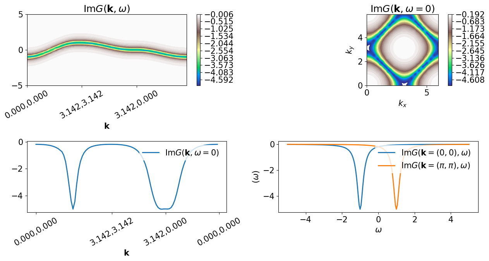
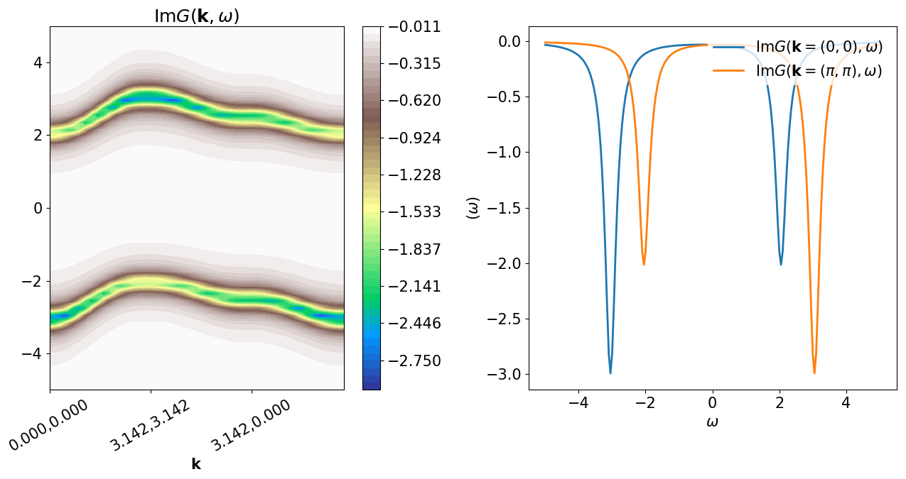

Green's functions defined on a lattice
======================================

This notebook shows a basic example of manipulation of
:math:`G(\mathbf{k},\omega)` defined on a 2D Brillouin zone.

.. code:: python

    from pytriqs.gf.local.multivar import *
    from pytriqs.gf.local import *
    from pytriqs.lattice import *
    from pytriqs.lattice.tight_binding import *
    from pytriqs.plot.mpl_interface import *
    %pylab inline

Defining the meshes
-------------------

Here we define a Bravais lattice object corresponding to a
two-dimensional square lattice, as well as the corresponding Brillouin
zone and a mesh defined on it.

.. code:: python

    BL = BravaisLattice(units = [(1,0,0) , (0,1,0) ]) #square lattice
    nk=20
    mk = MeshBrillouinZone(BrillouinZone(BL), nk)
    miw=MeshImFreq(beta=1., S="Fermion", n_max=100) #not used  (just demo)
    mprod_iw = MeshBrillouinZoneImFreq(mk, miw) # not used (just demo)
    
    mw=MeshReFreq(-5,5, 201)
    mprod = MeshBrillouinZoneReFreq(mk, mw)

Definition of the Green's function
----------------------------------

Here we define the Green's function as

.. math:: G(\mathbf{k},i\omega) = \frac{1}{\omega+i\eta - \varepsilon(\mathbf{k}) - \Sigma(\omega)}

where
:math:`\varepsilon(\mathbf{k}) = -2t\left(\cos(k_x)+\cos(k_y)\right)`
and :math:`\Sigma(\omega)` is the atomic-limit self-energy:

.. math:: \Sigma(\omega) = \frac{U^2}{4\omega}

.. code:: python

    #let us fill two G_k_w
    G_w = GfReFreq(mesh=mw, shape=[1,1])
    t=-0.25
    U=5.0
    eta=0.2
    G_k_w = GfBrillouinZone_x_ReFreq(mprod, [1,1])
    G_k_w_Mott = GfBrillouinZone_x_ReFreq(mprod, [1,1])
    ik=0
    for k in G_k_w.mesh.components[0]:
     G_w << inverse(iOmega_n-2*t*(cos(k[0])+cos(k[1]))+eta*1j)
     G_k_w.data[ik,:,0,0]=G_w.data[:,0,0]
     G_w << inverse(iOmega_n-2*t*(cos(k[0])+cos(k[1]))+eta*1j - 0.25*U**2*inverse(iOmega_n+eta*1j))
     G_k_w_Mott.data[ik,:,0,0]=G_w.data[:,0,0]
     ik+=1
    

Various plots
-------------

We plot various slices of :math:`G(\mathbf{k},\omega)` corresponding to
:math:`U=0` and :math:`U=4`.

.. code:: python

    gs=GridSpec(2,2)
    
    subplot(gs[0])
    title(r"$\mathrm{Im}G(\mathbf{k},\omega)$")
    oplot(G_k_w, path=[(0,0),(pi,pi),(pi,0),(0,0)], method="cubic", component="I", cmap=cm.terrain)
    colorbar()
    
    #color plot of slice at constant omega in the Brillouin zone
    #slice_at_const_w2 takes the linear frequency index as input  
    #method can be "nearest","linear", "cubic"
    #component can be "I" (imaginary) or "R" (real)
    subplot(gs[1],aspect="equal")
    title(r"$\mathrm{Im}G(\mathbf{k},\omega=0)$")
    oplot(G_k_w.slice_at_const_w2(len(G_k_w.mesh.components[1])/2), mode="contourf", component="I", method="cubic", cmap=cm.terrain)
    colorbar()
    
    #plot of slice at constant omega on a high-symmetry path
    subplot(gs[2])
    oplot(G_k_w.slice_at_const_w2(len(G_k_w.mesh.components[1])/2), path=[(0,0),(pi,pi),(pi,0),(0,0)], method="cubic",\
          component="I", label=r"$\mathrm{Im}G(\mathbf{k},\omega=0)$")
    
    #plot of slice at constant k
    #slice_at_const_w1 takes the integer coordinates of the k point
    subplot(gs[3])
    oplot(G_k_w.slice_at_const_w1([0,0,0]), label=r"$\mathrm{Im}G(\mathbf{k}=(0,0), \omega)$", mode="I")
    oplot(G_k_w.slice_at_const_w1([nk/2,nk/2,0]), label=r"$\mathrm{Im}G(\mathbf{k}=(\pi,\pi), \omega)$", mode="I")
    tight_layout()

.. code:: python

    
    gs=GridSpec(1,2)
    subplot(gs[0])
    title(r"$\mathrm{Im}G(\mathbf{k},\omega)$")
    oplot(G_k_w_Mott, path=[(0,0),(pi,pi),(pi,0),(0,0)], method="cubic", component="I", cmap=cm.terrain)
    colorbar()
    subplot(gs[1])
    oplot(G_k_w_Mott.slice_at_const_w1([0,0,0]), label=r"$\mathrm{Im}G(\mathbf{k}=(0,0), \omega)$", mode="I")
    oplot(G_k_w_Mott.slice_at_const_w1([nk/2,nk/2,0]), label=r"$\mathrm{Im}G(\mathbf{k}=(\pi,\pi), \omega)$", mode="I")
    tight_layout()

