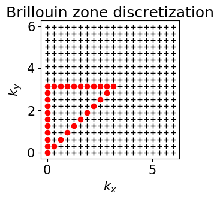
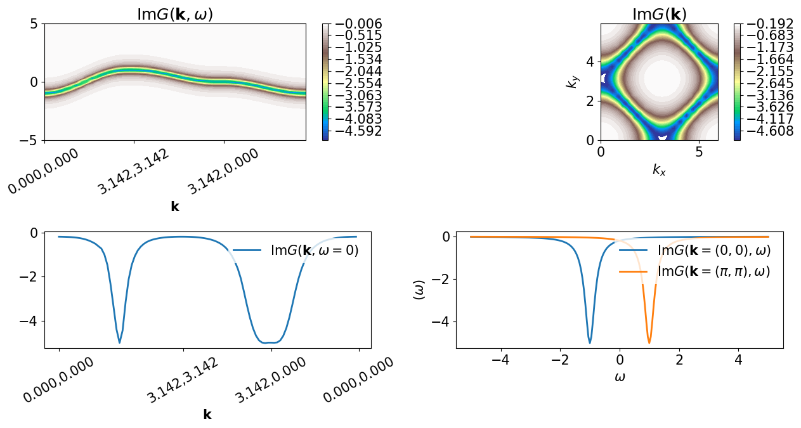

Green's functions defined on a lattice
======================================

This notebook shows a basic example of manipulation of
:math:`G(\mathbf{k},\omega)` defined on a 2D Brillouin zone.

.. code:: python

    from pytriqs.gf.local.multivar import *
    from pytriqs.gf.local import *
    from pytriqs.lattice import *
    from pytriqs.lattice.tight_binding import *
    from pytriqs.plot.mpl_interface import *

Defining the meshes
-------------------

Here we define a Bravais lattice object corresponding to a
two-dimensional square lattice, as well as the corresponding Brillouin
zone and a mesh defined on it.

.. code:: python

    BL = BravaisLattice(units = [(1,0,0) , (0,1,0) ]) #square lattice
    nk=20
    mk = MeshBrillouinZone(BrillouinZone(BL), nk)
    miw=MeshImFreq(beta=1., S="Fermion", n_max=100) #not used  (just demo)
    mprod_iw = MeshBrillouinZoneImFreq(mk, miw) # not used (just demo)
    
    mw=MeshReFreq(-5,5, 100)
    mprod = MeshBrillouinZoneReFreq(mk, mw)
    
    #define and draw path in BZ
    figure(figsize=(3,3))
    gs=GridSpec(1,1)
    subplot(gs[0],aspect="equal")
    title("Brillouin zone discretization")
    for m in mk:   plot(m[0],m[1],'+k')
        
    nkmid=nk/2
    path=[]
    for i in range(0,nkmid):    path.append((i,i))
    for i in range(0,nkmid):    path.append((nkmid-i,nkmid))
    for i in range(0,nkmid):    path.append((0,nkmid-i))
        
    for i,j in path:    plot(i*2*pi/nk,j*2*pi/nk,'or')
    xlabel(r"$k_x$");
    ylabel(r"$k_y$");

Definition of the Green's function
----------------------------------

Here we define the Green's function as

.. math:: G(\mathbf{k},i\omega) = \frac{1}{\omega+i\eta - \varepsilon(\mathbf{k}) - \Sigma(\omega)}

where
:math:`\varepsilon(\mathbf{k}) = -2t\left(\cos(k_x)+\cos(k_y)\right)`
and :math:`\Sigma(\omega)` is the atomic-limit self-energy:

.. math:: \Sigma(\omega) = \frac{U^2}{4\omega}

.. code:: python

    #let us fill two G_k_w
    G_w = GfReFreq(mesh=mw, shape=[1,1])
    t=-0.25
    U=5.0
    eta=0.2
    G_k_w = GfBrillouinZone_x_ReFreq(mprod, [1,1])
    G_k_w_Mott = GfBrillouinZone_x_ReFreq(mprod, [1,1])
    ik=0
    for k in G_k_w.mesh.components[0]:
     G_w << inverse(iOmega_n-2*t*(cos(k[0])+cos(k[1]))+eta*1j)
     G_k_w.data[ik,:,0,0]=G_w.data[:,0,0]
     G_w << inverse(iOmega_n-2*t*(cos(k[0])+cos(k[1]))+eta*1j - 0.25*U**2*inverse(iOmega_n+eta*1j))
     G_k_w_Mott.data[ik,:,0,0]=G_w.data[:,0,0]
     ik+=1
    
    #trick for the plot
    offset = GfBrillouinZone_x_ReFreq(mprod, [1,1])
    offset.data[:,:,0,0]=-0.2*1j

Photoemission spectrum
----------------------

We plot the ARPES spectrum corresponding to :math:`U=0` (black) and
:math:`U=4` (red).

.. code:: python

    title("ARPES spectrum along $(0,0)-(\pi,\pi)-(0,\pi)-(0,0)$")
    ind=0
    for i,j in path:
     oplot(((-1./pi)*(G_k_w+ind*offset).slice_at_const_w1([i,j,0])).imag, '-k', label=None)
     oplot(((-1./pi)*(G_k_w_Mott+ind*offset).slice_at_const_w1([i,j,0])).imag, '-r', label=None)
     ind+=1
    ylabel(r"$A(\mathbf{k},\omega)=-\frac{1}{\pi}\mathrm{Im}G(\mathbf{k},\omega)$");

