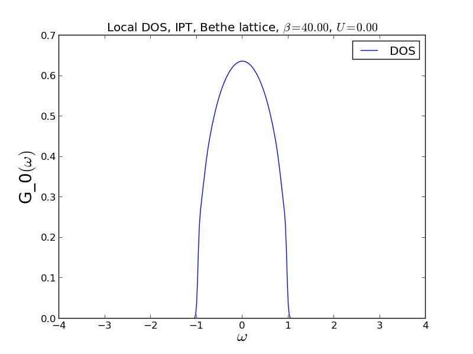

.. _ipt:

Iterated perturbation theory: an extended DMFT example
========================================================

Introduction
------------

The iterated perturbation theory (IPT) was one of the first methods used to solve the
DMFT equations [#ipt1]_. In spite of its simplistic nature, IPT gives a qualitatively
correct description of a Mott metal-insulator transition in the Hubbard model on
infinite-dimensional lattices (on the quantitative level it tends to underestimate
correlations though). In IPT one iteratively solves the DMFT equations using the
second-order perturbation theory in Hubbard interaction :math:`U` to approximate
the impurity self-energy. For the particle-hole symmetric case it reads

.. math::

    \Sigma(i\omega_n) \approx \frac{U}{2} +
        U^2 \int_0^\beta d\tau e^{i\omega_n\tau} G_0(\tau)^3

A Hartree-Fock contribution :math:`U/2` in the self-energy cancels with a term
from :math:`G_0(i\omega_n)^{-1}` when the functions are substituted into the
Dyson's equation. For this reason this contribution is usually omitted from
both functions.

The success of IPT is caused by the fact that it becomes exact not only in the
weak coupling limit (by construction), but also reproduces an atomic-limit
expression for :math:`\Sigma(i\omega_n)` as :math:`U` grows large [#ipt2]_.

Our sample implementation of IPT includes two files: `ipt.py` and
`mott.py`.

IPT solver and self-consistency loop
------------------------------------

The file `ipt.py` implements the weak coupling perturbation theory for a 
symmetric single-band Anderson model (`Solver` class) and obeys
:ref:`the solver concept<solver_concept>`. It also runs a DMFT loop with this
solver and with a self-consistency condition provided from outside (function `run`).

All Green's functions in the calculations consist of one Matsubara block
(there is no need for spin indices, since only paramagnetic solutions are sought).

.. literalinclude:: ipt.py

Visualization of a Mott transition
----------------------------------

In `mott.py` the IPT module is used to run DMFT many times and scan a range of 
values of :math:`U`. On every run the resulting data are saved in 
an :ref:`HDF5 archive<hdf5_base>` and the density of states is plotted into
a PNG file using the :ref:`TRIQS matplotlib interface<plotting>`
(:math:`G(i\omega_n)` is analytically continued to the real axis by the
:ref:`Padé approximant<GfReFreq>`). 

At the end of the script an external utility `convert` is invoked to join the
DOS plots into a single animated GIF file which illustrates how a metallic
solution evolves towards an insulator.

.. literalinclude:: mott.py

The result of this script is an animated gif:

Journal references
------------------

.. [#ipt1] A. Georges and G. Kotliar,
           Phys. Rev. B 45, 6479–6483 (1992).
.. [#ipt2] X. Y. Zhang, M. J. Rozenberg, and G. Kotliar,
           Phys. Rev. Lett. 70, 1666–1669 (1993)
