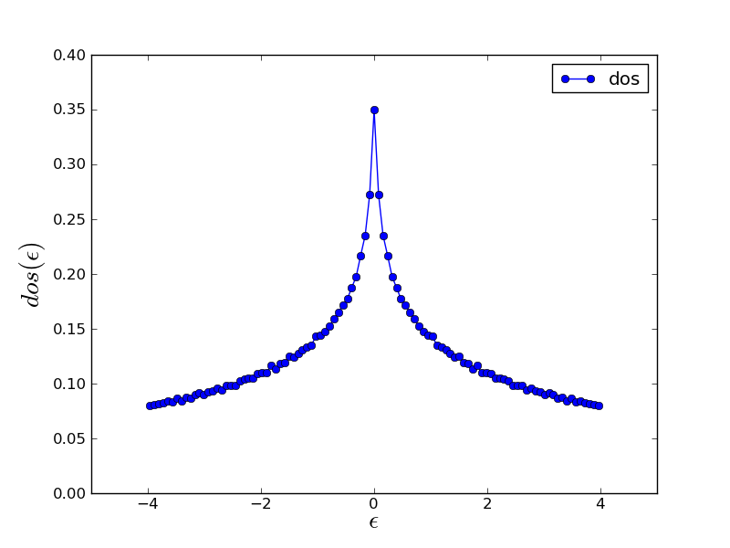

Tour 2: A tight-binding model on a square lattice
-------------------------------------------------

Let us now consider free fermions on a Bravais lattice. 
We will set up a square lattice with the nearest
neighbour hopping using the ``BravaisLattice`` class of TRIQS, compute its
density of states (DOS) and then plot it by using again the ``oplot`` function.

.. literalinclude:: ../../reference/python/lattice/ex1.py
   :lines: 1-34

More information on the lattice tools implemeted in TRIQS can be :doc:`found here <../../reference/python/lattice/lattice>`

